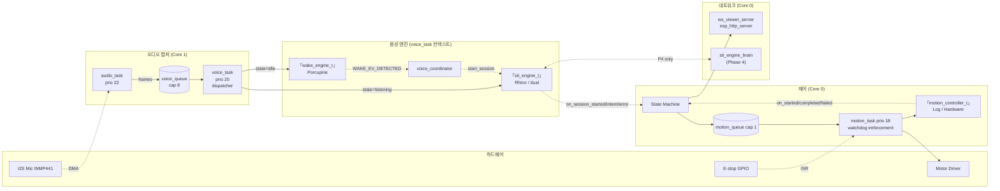
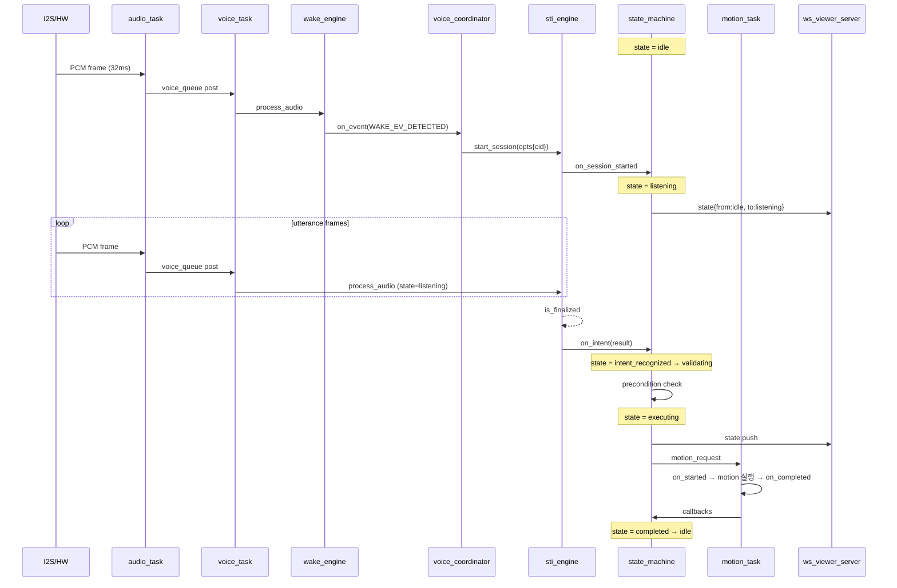
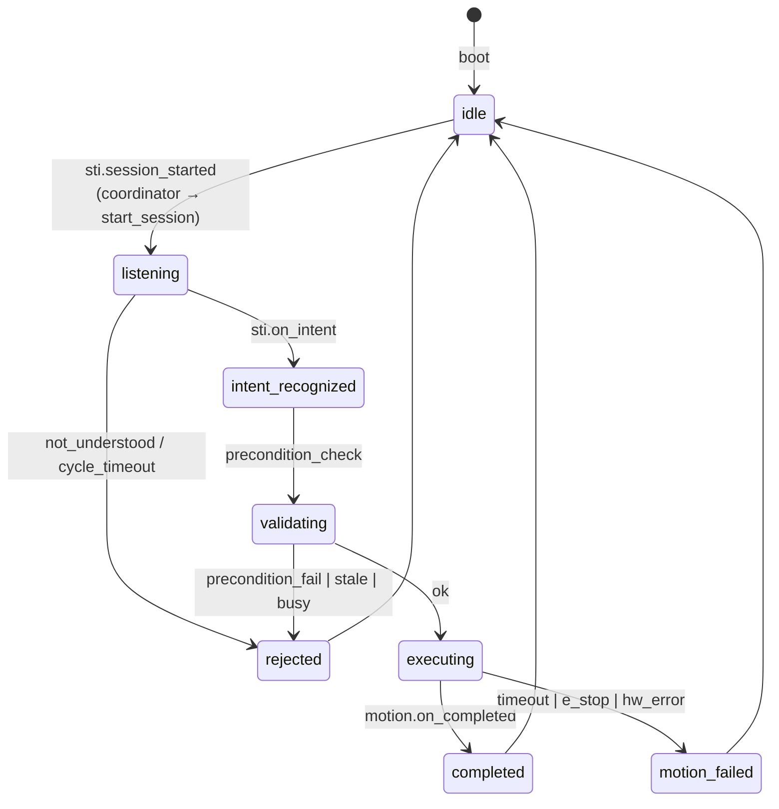

# MCU — 모듈 아키텍처

ESP32-S3 단일 디바이스에서 음성 → intent → motion 전체 흐름을 조율. 외부와는 viewer (WS 서버) + brain (WS 클라이언트, P1 부터 필수) 통신.

> **2026-04-27 PIVOT**: 원래 P1 wake = Picovoice Porcupine, sti = Picovoice Rhino 가정이었으나 Picovoice 가 ESP32-S3 (Xtensa) 미지원 발견. Wake = microWakeWord 한국어 (TFLite Micro), STI = brain (WS to RPi) 로 변경. brain 도입이 P4 → P1 으로 이동. 인터페이스 (`wake_engine_t`, `sti_engine_t`) 는 그대로, 구현체만 swap. 자세한 reasoning 은 `DECISIONS.md` 2026-04-27 entry 참고. 아래 Mermaid 라벨은 cosmetic 으로 남아있으며 향후 정리 예정.

---

## 컴포넌트 다이어그램



---

## 핵심 데이터 흐름 — 한 음성 명령 사이클



---

## Audio fan-out 정책 (race-free)

핵심 원칙: **단일 dispatcher, 상태 기반 라우팅**.

```
DMA → audio_task → voice_queue (cap 8)
                        │
                        ▼
                  voice_task
                  ─ FSM 상태 read ─┐
                                     ▼
                          ┌─────────────────┐
                          │  if idle        │
                          │    wake.process │
                          │  if listening   │
                          │    sti.process  │
                          └─────────────────┘
```

- 두 엔진에 동시 feed **절대 안 함** — race / double-consume 차단
- `voice_queue` 가득 차면 frame drop + counter 증가 (motion 안전성 우선)
- 모든 엔진 API 호출과 콜백 발화는 **`voice_task` 컨텍스트에서만**

---

## State Machine



**전이 규칙**:
- 모든 전이는 `voice_task` 또는 `motion_task` 단일 thread에서만 (mutex 불필요)
- `idle`이 아닐 때 새 wake 신호 도달 → 무시 + busy 카운터 증가
- 정의되지 않은 전이 → `ESP_LOGE` + 무시 (panic X)

---

## Task 토폴로지 (priority/core 격리)

| Task | Core | Priority | 책임 | 격리 이유 |
|------|------|---------|------|----------|
| `wifi/lwip` | 0 | 23 (시스템) | Wi-Fi stack | 시스템 우선 |
| `audio_task` | **1** | 22 | I2S DMA → voice_queue | 오디오 hot path 보호 |
| `voice_task` | **1** | 20 | wake/sti dispatch + 콜백 | 음성 처리 격리 |
| `motion_task` | **0** | 18 | 모터 제어 + watchdog | **네트워크와 다른 코어** — WS stall이 motor safety에 영향 X |
| `ws_task` (P2~) | 0 | 12 | viewer broadcast | 가장 낮은 우선순위 |

→ **motion이 Core 0에서 격리**되는 게 핵심 안전 결정. WS/Wi-Fi가 stall해도 motion 제어와 watchdog은 정상 동작.

---

## 외부 경계 (다른 모듈/시스템)

```
┌──────────────────────────────────┐
│  mcu (ESP32-S3)                  │
│                                  │
│  ┌─────────────┐                 │
│  │ ws_viewer_  │  ← viewer (WS) │  → docs/protocol/mcu-viewer.md
│  │ server      │                 │
│  └─────────────┘                 │
│                                  │
│  ┌─────────────┐                 │
│  │ sti_engine_ │  ↔ brain (WS)  │  → docs/protocol/mcu-brain.md
│  │ brain (P4)  │                 │     (Phase 4 only)
│  └─────────────┘                 │
└──────────────────────────────────┘
```

**잠금**: 양쪽 통신 계약 모두 사용자 승인 없이 변경 X.

---

## Phase별 활성 컴포넌트

| Phase | 활성 구현 | 비활성 |
|-------|---------|------|
| 1 | wake_microwakeword + sti_brain + LogMotionController | ws_server, motor, sti_dual fallback |
| 2 | + ws_viewer_server (esp_http_server) | motor, sti_dual fallback |
| 3 | LogMotionController **→ HardwareMotionController** + e-stop ISR | sti_dual fallback |
| 4 | sti_brain **→ sti_dual(brain, fallback)** (fallback 정체 결정 필요) | — |
| 5 | (변경 없음, Unity가 같은 WS 프로토콜로 접속) | — |
| 6 | wake/sti 모델 quality 개선 + DEV_MODE off + 인증/암호화 | manual_trigger |

→ 인터페이스는 변경 없음. 모든 phase 변경은 `main.c` 의 factory 호출 교체로 환원.

---

## 메모리 배치 정책

| 영역 | 배치 | 이유 |
|------|------|------|
| I2S DMA buffer | **Internal RAM** | 낮은 latency 필수 |
| voice_queue / motion_queue | Internal RAM | 자주 access |
| microWakeWord .tflite 모델 + TFLite arena | PSRAM | 큰 footprint, 한 번 로드 |
| brain WS send buffer | Internal RAM | 송신 hot path |
| WS broadcast 큐 페이로드 (viewer, P2~) | Internal RAM | 송신 hot path |
| 로그 버퍼 / debug | PSRAM | 비-critical |
| PCM ring buffer (5초, sti_dual P4 대비) | PSRAM | 5초 × 16kHz × 2 = 160 KB, latency 덜 critical |

---

## Latency 예산 (Phase 1 목표)

원래 (Picovoice 가정) 800ms P95 였으나, brain 왕복 포함으로 1500ms P95 로 완화.

| 단계 | P50 | P95 |
|------|-----|-----|
| microWakeWord detect (TFLite Micro inference + smoothing) | < 200ms | < 400ms |
| brain WS roundtrip (Wi-Fi LAN + Whisper inference + intent classifier) | < 600ms | < 1000ms |
| FSM 검증 + motion start | < 30ms | < 60ms |
| **End-to-end (wake → motion 시작)** | **< 900ms** | **< 1500ms** |

측정 위치: `audio_task` 첫 wake 감지 시각 → `motion_task` 의 `on_started` 발화 시각, monotonic ms diff.

(Whisper-base 한국어 RPi 4 기준 약 200~500ms. 모델 사이즈 + RPi 부하에 따라 다름. P1 Gate 전에 실측 후 조정 가능.)
